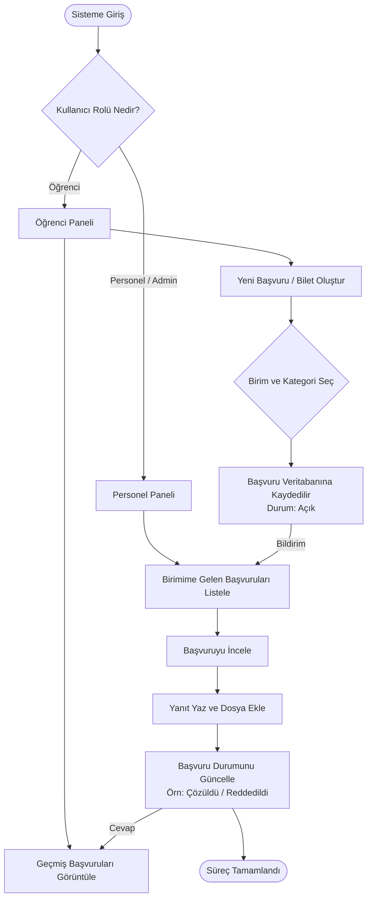

# Kampüs Çözüm Merkezi - Veritabanı Projesi Bilgileri

## 1. Proje Hakkında
**Kampüs Çözüm Merkezi**, üniversite bünyesindeki öğrenci taleplerini dijitalleştirerek bürokrasiyi azaltmayı hedefleyen, ilişkisel veritabanı mimarisiyle kurgulanmış bir kurumsal otomasyon projesidir. Öğrencilerin şikayet ve önerilerini doğrudan ilgili dekanlık veya daire başkanlıklarına iletmelerine, süreçleri ise şeffaf bir biletleme (ticketing) mekanizmasıyla takip etmelerine olanak tanır. Rol tabanlı erişim kontrolü sayesinde admin, personel ve öğrenci panelleri arasında güvenli bir hiyerarşi kurar.

## 2. Ders ve Proje Gereksinimleri (PDF Özeti - YMÜ232)
* **Veritabanı Yapısı:** İlişkisel olarak tasarlanmış (veya NoSQL tercih edilebilir) olmalı ve **en az beş tablodan** oluşmalıdır.
* **Mimari:** Backend ve Frontend içermelidir. Kullanıcının erişemediği bir **admin panel** ve etkileşimli bir **frontend arabirim** bulunmalıdır.
* **Proje Grupları:** En fazla 3 kişilik gruplar halinde yapılabilir. Her bir modülün hangi grup üyesi tarafından yapılacağı belirtilmelidir.
* **Teslim Dokümanı:** Proje en son teslim edilirken veritabanından kullanıcı arabirimine kadar tüm otomasyonun anlatıldığı bir **Word dokümanı** teslim edilecektir. Dokümansız projeler doğrudan sıfır alacaktır.
* **Teknoloji:** Programlama dilleri, web teknolojileri ve veritabanı yönetim sistemi serbesttir. Ancak yazılan kodlara ve mimariye tam hakimiyet şarttır.

## 3. Seçilen Teknoloji Yığını (Tech Stack)
* **Backend:** PHP
* **Veritabanı:** MySQL
* **Mimari Yaklaşım:** PHP ile MySQL veritabanına bağlanılarak CRUD işlemleri (Ekleme, Okuma, Güncelleme, Silme) yapılacak ve ön yüzle (Frontend) iletişim kurulacaktır.

## 4. Veritabanı İlişki Şeması (ER Şeması)

Sistem, işleyişini 5 temel tablo üzerinden gerçekleştirmektedir. Tablolar, alanları ve veri tipleri aşağıda listelenmiştir. Türkçe tablo ve kolon isimleri kullanılmıştır.

### Tablo 1: Kullanicilar
Sisteme giriş yapacak herkesi (Öğrenci, Personel, Admin) tutan ana tablodur.
* `KullaniciID` : Integer **(Primary Key)** - Benzersiz kullanıcı kimliği.
* `AdSoyad` : Varchar - Kullanıcının Adı ve Soyadı.
* `Eposta` : Varchar - Giriş için kullanılacak e-posta adresi.
* `Sifre` : Varchar - Şifrelenmiş parola.
* `Rol` : Enum ('Ogrenci', 'Personel', 'Admin') - Kullanıcı rollerini belirler.
* `BirimID` : Integer **(Foreign Key)** - Personelin hangi birime ait olduğunu belirtir. (Öğrenciler için boş kalabilir).

### Tablo 2: Birimler
Taleplerin yönlendirileceği idari birimleri (Mühendislik Fakültesi, Öğrenci İşleri vb.) tanımlar.
* `BirimID` : Integer **(Primary Key)** - Benzersiz birim kimliği.
* `BirimAdi` : Varchar - Birim adı.
* `Konum` : Varchar - Birimin kampüsteki yeri (Opsiyonel).

### Tablo 3: Kategoriler
Başvuruların konusuna göre (Yemekhane, Altyapı, Sınavlar vb.) sınıflandırılmasını sağlar.
* `KategoriID` : Integer **(Primary Key)** - Benzersiz kategori kimliği.
* `KategoriAdi` : Varchar - Kategori adı.
* `Oncelik` : Enum ('Düşük', 'Orta', 'Yüksek') - Kategorinin varsayılan öncelik durumu.

### Tablo 4: Basvurular
Öğrenciler tarafından oluşturulan taleplerin tutulduğu tablodur.
* `BasvuruID` : Integer **(Primary Key)** - Benzersiz başvuru numarası.
* `KullaniciID` : Integer **(Foreign Key)** - Başvuruyu yapan öğrencinin ID'si.
* `KategoriID` : Integer **(Foreign Key)** - Talebin kategorisi.
* `BirimID` : Integer **(Foreign Key)** - Talebin iletildiği birim.
* `Baslik` : Varchar - Başvuru başlığı.
* `Aciklama` : Text - Sorunun veya önerinin detaylı içeriği.
* `Durum` : Enum ('Açık', 'İnceleniyor', 'Çözüldü', 'Reddedildi') - Başvuru durumu.
* `OlusturulmaTarihi` : DateTime - Başvurunun yapıldığı tarih ve saat.

### Tablo 5: Yanitlar
İdari kadronun öğrenciye verdiği cevapları ve eklenen belgeleri tutar.
* `YanitID` : Integer **(Primary Key)** - Benzersiz yanıt kimliği.
* `BasvuruID` : Integer **(Foreign Key)** - Yanıtın hangi başvuruya (bilete) ait olduğu.
* `YanitlayanID` : Integer **(Foreign Key)** - Yanıtlayan personelin / adminin ID'si (Kullanicilar tablosuna bağlanır).
* `Mesaj` : Text - Yanıtın içeriği.
* `EkYolu` : Varchar - Eklenen belgenin yolu.
* `GonderilmeTarihi` : DateTime - Yanıtın gönderildiği tarih ve saat.

## 5. Tablolar Arası İlişkiler (Bağlantılar)
Kağıda şemayı çizerken tablolar arasında oklarla göstermeniz gereken ilişkiler (Foreign Key -> Primary Key) şunlardır:

1. **`Kullanicilar`** tablosundaki `BirimID` alanı ---> **`Birimler`** tablosundaki `BirimID` alanına bağlanır. (Bir kullanıcı bir birime ait olabilir).
2. **`Basvurular`** tablosundaki `KullaniciID` alanı ---> **`Kullanicilar`** tablosundaki `KullaniciID` alanına bağlanır. (Bir başvuruyu bir kullanıcı oluşturur).
3. **`Basvurular`** tablosundaki `KategoriID` alanı ---> **`Kategoriler`** tablosundaki `KategoriID` alanına bağlanır. (Bir başvuru bir kategoriye aittir).
4. **`Basvurular`** tablosundaki `BirimID` alanı ---> **`Birimler`** tablosundaki `BirimID` alanına bağlanır. (Bir başvuru bir birime atanır).
5. **`Yanitlar`** tablosundaki `BasvuruID` alanı ---> **`Basvurular`** tablosundaki `BasvuruID` alanına bağlanır. (Bir yanıt bir başvuruya verilir).
6. **`Yanitlar`** tablosundaki `YanitlayanID` alanı ---> **`Kullanicilar`** tablosundaki `KullaniciID` alanına bağlanır. (Bir yanıtı bir kullanıcı yazar).

## 6. Proje Akış Diyagramı (Flowchart)
Aşağıdaki şema, sisteme giriş yapan bir kullanıcının rolüne (Öğrenci veya Personel) göre Kampüs Çözüm Merkezi projesindeki işleyişi adım adım göstermektedir.

## 7. Veritabanı Kurulum Seçenekleri (SQL Dosyaları)

Proje veritabanını kurmak ve test etmek için iki farklı seviyede SQL scripti hazırlanmıştır:

### A. Standart 5 Tablolu Kurulum ([veritabani_kurulum.sql](file:///c:/Users/yusuf/OneDrive/Desktop/veri_taban%C4%B1/veritabani_kurulum.sql))
Bu dosya, yukarıdaki ER şemasında belirtilen standart tasarımı birebir uygular. Rol ve durum alanları için `ENUM` veri tipi kullanılır.
* **Kullanım Amacı:** Basit ve doğrudan ER şemasını uygulayarak hızlıca başlamak.
* **Öne Çıkan Özellikler:** İlişkisel bütünlük kısıtlamaları (Foreign Keys) kurulmuştur. Testlerinizi hemen yapabilmeniz için hazır **öğrenci, personel, admin, birim, kategori ve bilet (başvuru) örnek verilerini (seed data)** otomatik ekler.

### B. İleri Düzey Normalize 7 Tablolu Kurulum ([veritabani_kurulum_7_tablo.sql](file:///c:/Users/yusuf/OneDrive/Desktop/veri_taban%C4%B1/veritabani_kurulum_7_tablo.sql))
Bu dosya, **"Rolleri neden ENUM yaptın?"** şeklindeki akademisyen eleştirilerini çözmek ve sistemi daha esnek hale getirmek amacıyla tasarlanmıştır.
* **Kullanım Amacı:** Yüksek normalizasyon puanı almak ve kurumsal standartta bir veritabanı sunmak.
* **Eklenen Tablolar:**
  1. `Roller` Tablosu: `ENUM('Ogrenci', 'Personel', 'Admin')` yerine `RolID` ve `RolAdi` tutan bağımsız tablo.
  2. `Durumlar` Tablosu: `ENUM('Açık', 'İnceleniyor', 'Çözüldü', 'Reddedildi')` yerine `DurumID`, `DurumAdi` ve arayüz entegrasyonu için `RenkKodu` (HEX rengi) tutan bağımsız tablo.
* **Öne Çıkan Özellikler:** `Durumlar` tablosundaki `RenkKodu` alanı sayesinde, frontend arayüzünde her bir bilet durumuna göre dinamik renkli rozetler (badge) gösterilebilir (Örn: Çözüldü için yeşil, Açık için kırmızı). Bu versiyon da hazır örnek verileriyle birlikte kurulur.

